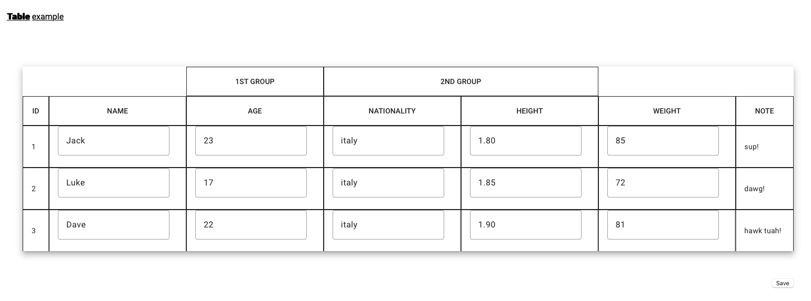

# AngularMatColumnGroup

### Creating a mat table by grouping columns, useful when you maybe have more group by of data
#### Readonly implemented
#### ngModel applied for data change
#### Save implemented

##### the example table will look like this

